# Docstack


# Overview

DocStack is a knowledge workspace application that allows users to organise ideas, write documents, and build connected knowledge inside structured topics.

Instead of scattered notes and disconnected files, DocStack keeps everything in one place. Users can create topics, write rich documents, link content together, and automatically generate knowledge graphs that show how concepts relate to each other.

DocStack removes the friction from managing information. The app handles document storage, autosave, concept extraction, and graph generation automatically, so you can focus on thinking, learning, and building knowledge rather than organising files.

The goal of DocStack is to make personal knowledge feel structured, visual, and easy to navigate, without turning note-taking into a complicated process.


 

# User Interface
### Onboarding Screens

| Welcome | Sign Up |
|--------|--------|
| 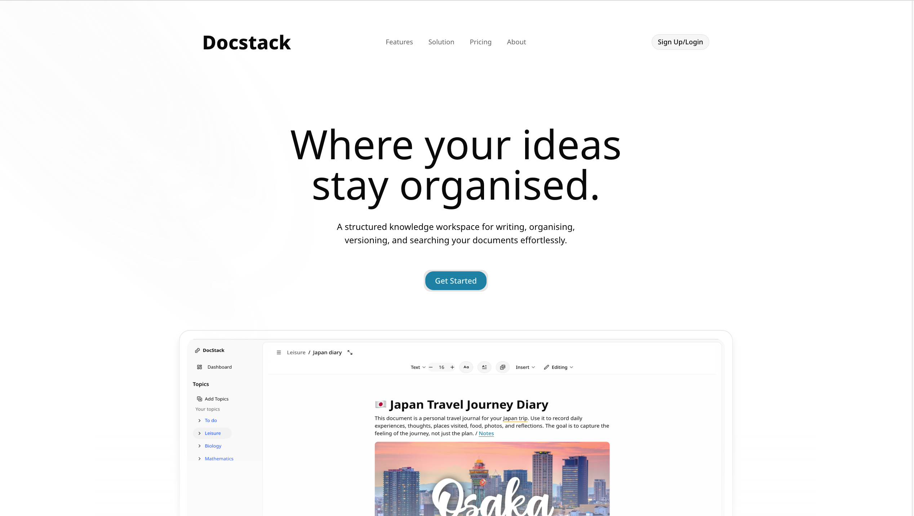 | 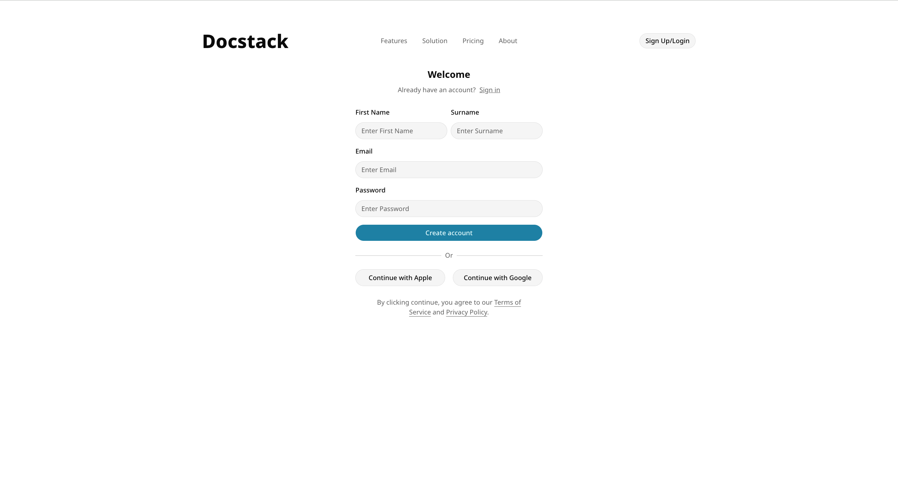 |


<!-- | Sign Up (Email OTP) | Login |
|-------------------|-------|
| 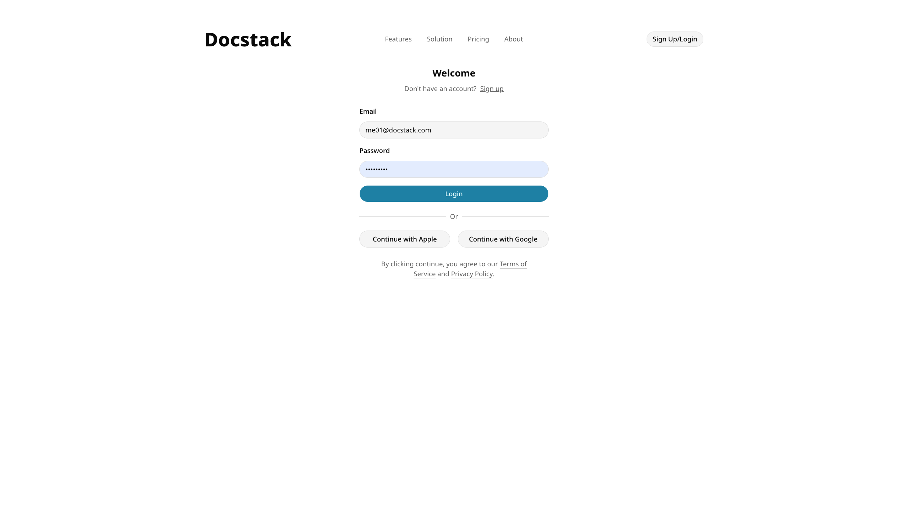 |  | -->

| Dashboard | Editor() |
|--------|--------|
| 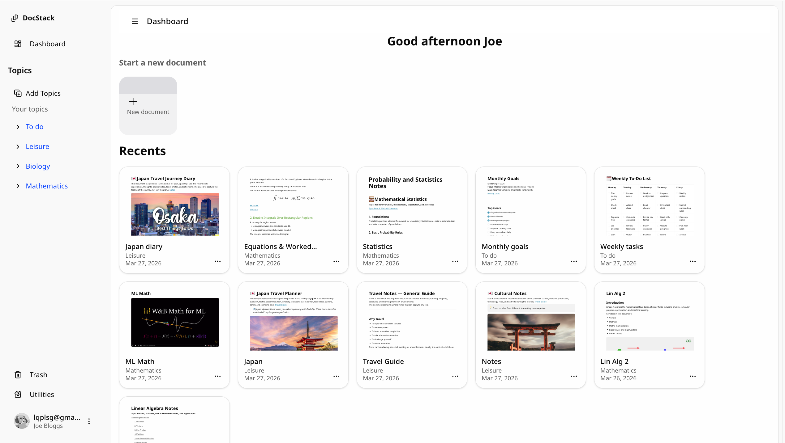 |  |

| Graph view | Editor() |
|--------|--------|
| 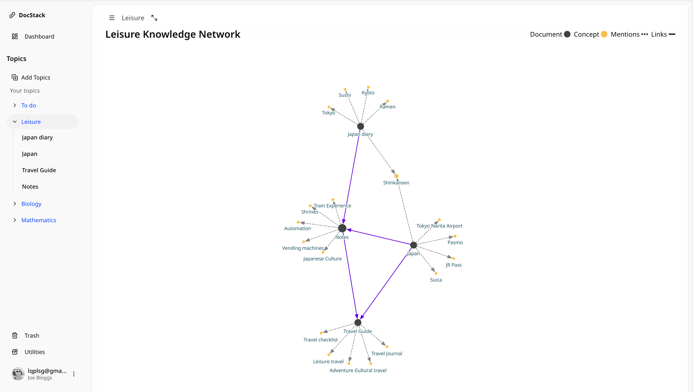 | 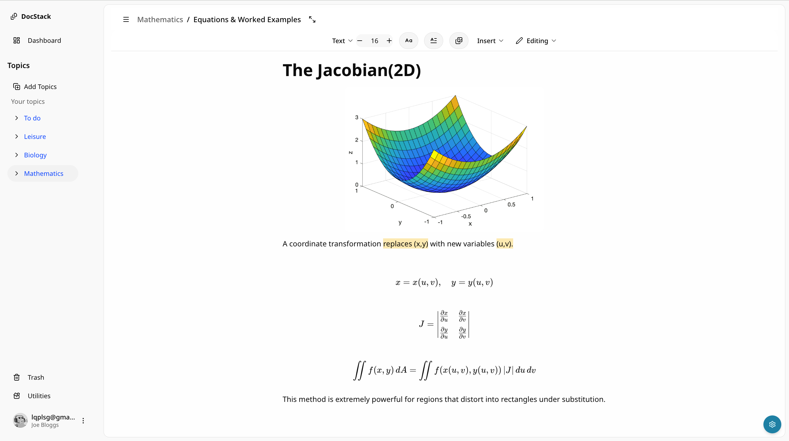 |

| Editor() | Editor() |
|--------|--------|
| 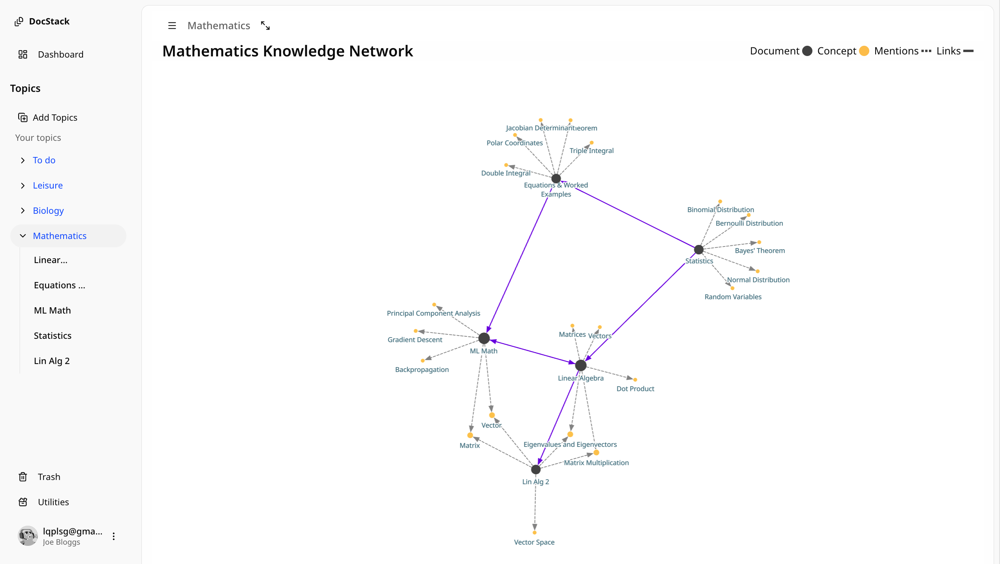 | 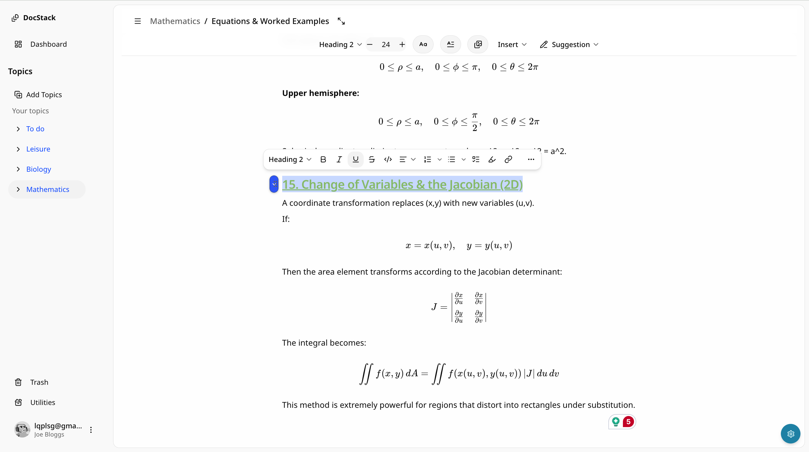 |


# Backend Architecture 

DocStack is a knowledge workspace application that allows users to create topics, write documents and build knowledge graphs (create connections between documents).  

The system uses a Spring Boot backend, MongoDB storage, Clerk authentication and AI for concept distillation.

<!-- The backend is responsible for:

- User-scoped data access
- Topic & document management
- Knowledge graph generation
- Concept distillation  -->

---

## Tech Stack

| Layer | Technology |
|--------|------------|
| Backend | Java, Spring Boot |
| Database | MongoDB |
| Auth | Clerk JWT |
| Storage | Cloudflare R2 |
| AI | OpenAI API |
| Build | Maven |
| Container | Docker / Docker Compose |

---

## Backend Folder Structure

```
docstack-backend
├── docker-compose.yml
├── pom.xml
├── src/main/java/com/octo/docstack
│
├── common
│   └── CurrentUserService
│
├── config
│   ├── SecurityConfig
│   ├── MongoConfig
│   ├── R2Config
│   ├── AiConfig
│   ├── HttpClientConfig
│   └── AsyncConfig
│
├── controller
│   ├── document
│   ├── topic
│   ├── graph
│   └── profile
│
├── dto
│   ├── document
│   ├── topic
│   ├── graph
│   ├── profile
│   └── ai
│
├── models
│   ├── document
│   ├── topic
│   ├── graph
│   └── profile
│
├── repository
│   ├── document
│   ├── topic
│   ├── graph
│   └── profile
│
├── service
│   ├── document
│   ├── topic
│   ├── graph
│   ├── profile
│   └── ai
│
└── listeners
    └── DocumentGraphEventListener
```

---

## Authentication & Authorization

Clerk handles authentication.  
The frontend sends a JWT to the backend, and Spring Security validates it.

Each request is scoped to the current user.

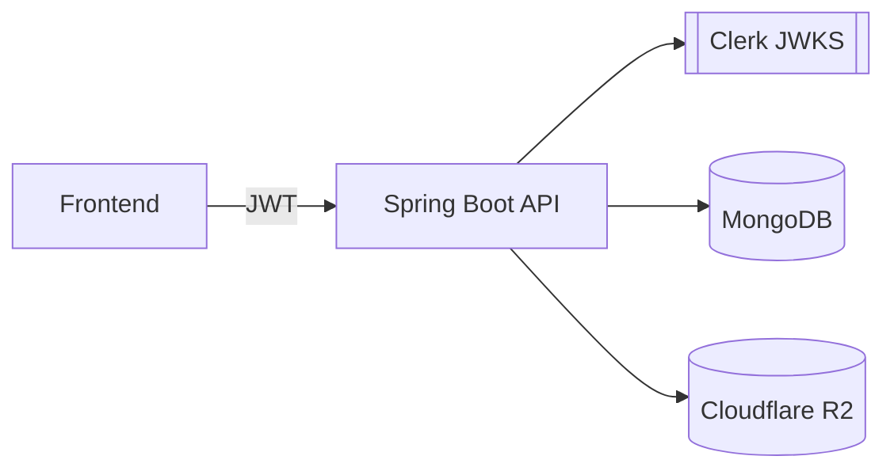

---

## Sign In Flow

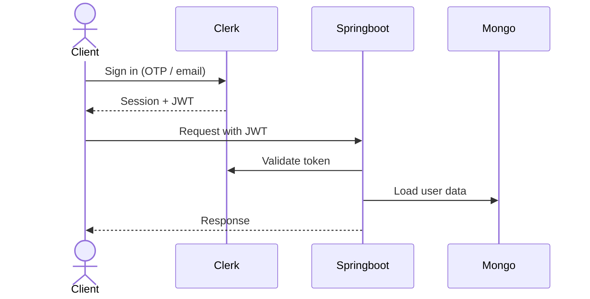

---

## Topic & Document Flow

Users create topics → create documents → edit content → autosave → graph sync

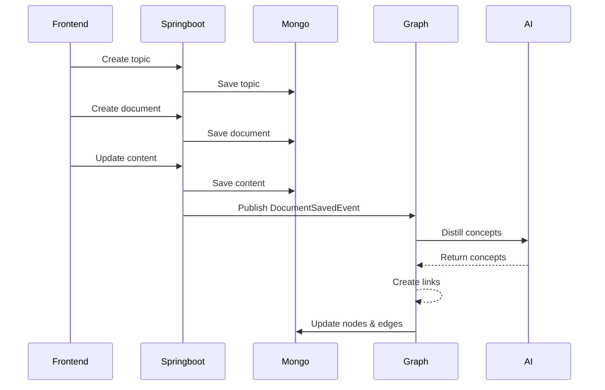

---

## Knowledge Graph Architecture

Each topic has its own graph.

Nodes:
- DOCUMENT
- CONCEPT

Edges:
- LINKS_TO
- MENTIONS


Graph is rebuilt when a document is saved.

---

<!-- ## Document Save → Graph Sync

Document save triggers an event.

```
DocumentService
   ↓
DocumentSavedEvent
   ↓
DocumentGraphEventListener
   ↓
DocumentGraphSyncService
   ↓
ConceptExtractionService (OpenAI)
   ↓
GraphService
```

--- -->

## Thumbnail Upload Flow

Thumbnails are stored in Cloudflare R2 using presigned URLs.

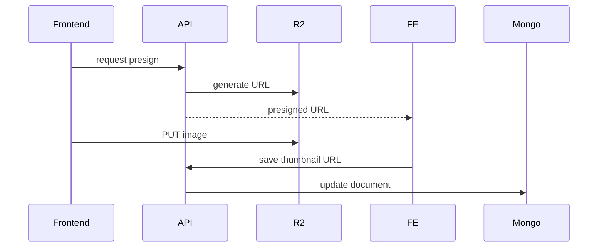

<!-- ---

## AI Concept Extraction

Concepts are extracted from document text.

```
Plate JSON → Text Extractor
Text → LLM 
LLM → Concepts
Concepts → Graph nodes
```

Services involved:

- `PlateTextExtractor`
- `ConceptExtractionService`
- `LlmGateway`
- `GraphService` -->

---

## Data Flow

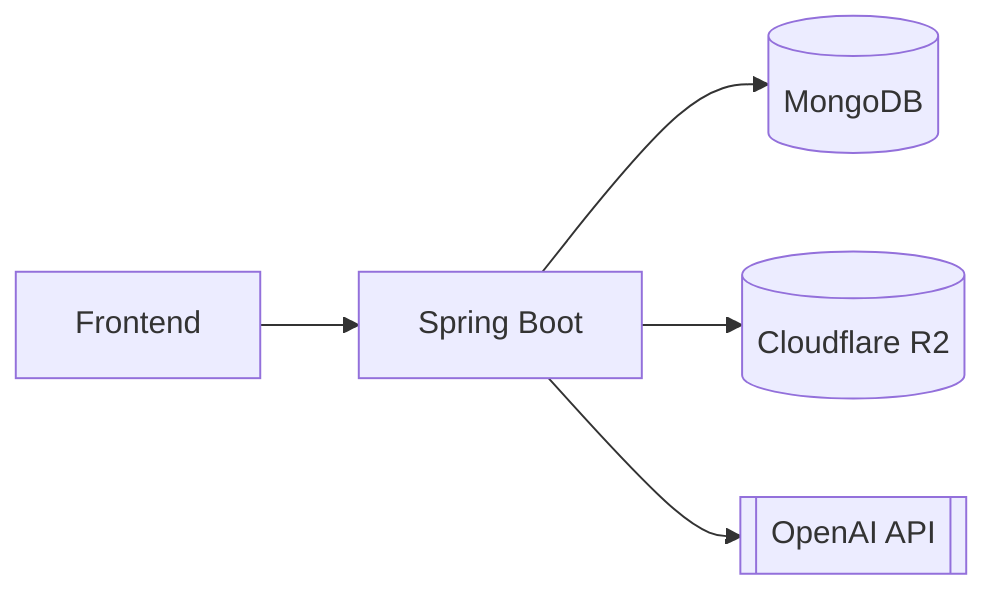

---


## Future Improvements

- Vector search
- Graph queries
- Full-text search
- Realtime collaboration
- Canvas
- Richer editor
 


