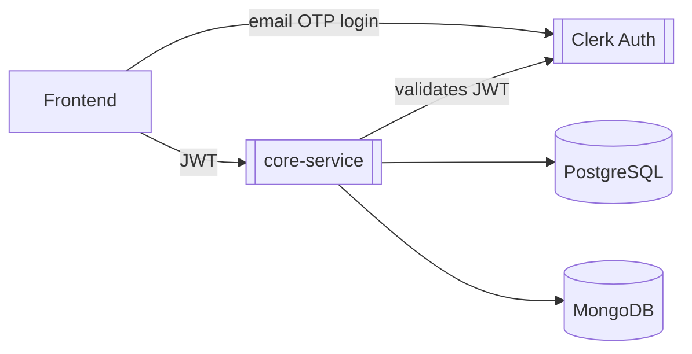
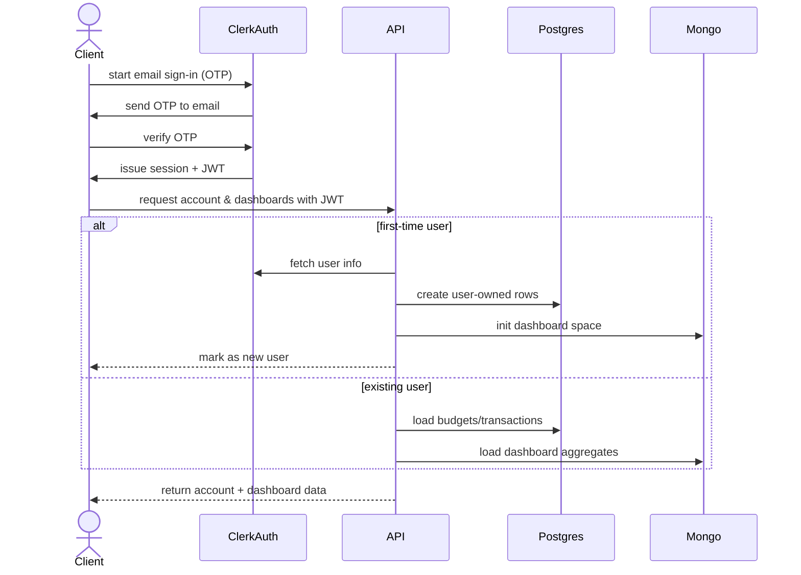
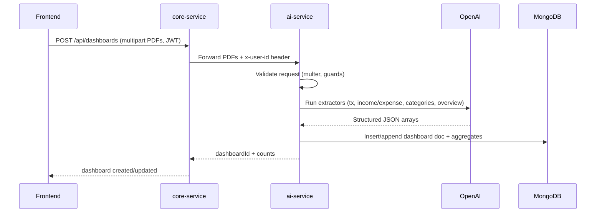
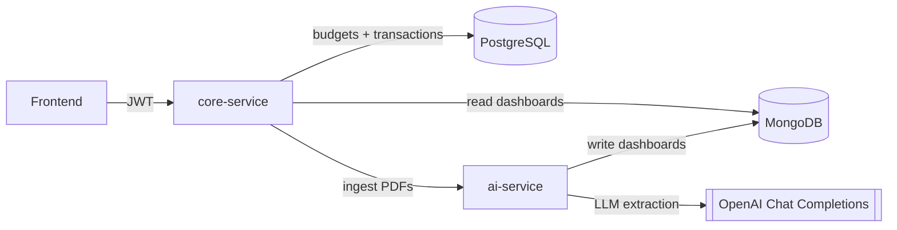

# Overview

BudgetlyAI is a simple personal finance app that helps you see how your money is spent and to create budgets that can help you manage your money better. 

BudgetlyAI makes sense of your finances without having to turn budgeting into a second job. The app does the boring work of extracting transactions, organising them by month and category, and presenting them in a way that actually makes sense.


 

# User Interface
### Onboarding Screens

| Welcome | Sign Up |
|--------|--------|
|  |  |

| Sign Up (Email OTP) | Login |
|-------------------|-------|
|  |  |


# Backend Architecture

BudgetlyAI process statements through an AI pipeline, extracts spending data from the statements and persists this extracted data into mongoDB.

 Two services:
- `core-service`: ASP.NET Core API for authentication, dashboards and budgets.
- `ai-service`: Node  service that runs the LLM extraction workflow and writes dashboard aggregates to MongoDB.

## Folder Structure & Tech Stack
```
├── core-service
│   ├── Controllers
│   ├── Data
│   ├── Infrastructure
│   ├── Models
│   └── Services
└── ai-service
    ├── src
    │   ├── config
    │   ├── controllers
    │   ├── db
    │   ├── llm
    │   ├── mappers
    │   ├── routes
    │   └── services
    └── package.json
```

| Language | Framework / Runtime |
|----------|---------------------|
| C# | ASP.NET Core |
| TypeScript | NodeJS (Express)  |
| SQL | PostgreSQL (EF Core) |

<br>


### Authentication & Authorization
Clerk handles email-first authentication. Users receive OTP codes via email the .NET API validates Clerk JWTs and scopes data per user.



### Sign in/Sign up Sequence


### Ingestion & AI Pipeline


### Data Flow

